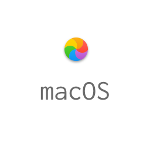

# macOS

This is a collection of configuration files to setup a new macbook. A big source of inspiration was 
https://github.com/mathiasbynens/dotfiles as well as https://github.com/mzdr/macOS.

- https://hci.rwth-aachen.de/USGermanKeyboard
- https://echo.co/blog/os-x-1010-yosemite-local-development-environment-apache-php-and-mysql-homebrew
- https://github.com/evert/phpunit-bin
- https://github.com/hirak/prestissimo

# TODO

- 𐄂 Make configuration parameterizeable (e.g. username, directories etc.)
- 𐄂 Add zsh syntax highlighting (https://github.com/zsh-users/zsh-syntax-highlighting)
- 𐄂 Add option for Pure (https://github.com/sindresorhus/pure)
