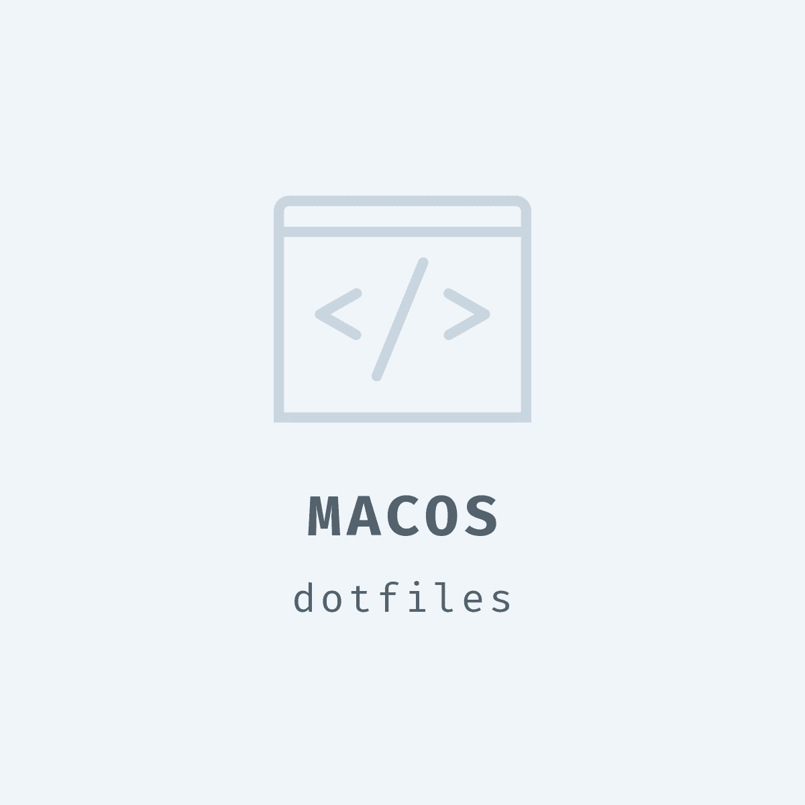

  

# macOS

This is a collection of configuration files to setup a new macbook. A big source of inspiration was 
https://github.com/mathiasbynens/dotfiles as well as https://github.com/mzdr/macOS.

## What you get

- [zsh] as your default shell
- [oh my zsh] for managing your Zsh configuration
- Easier German umlauts on Macs with US keyboards https://hci.rwth-aachen.de/USGermanKeyboard
- MAMP environment with apache from `homebrew` run under your user (no more permission headaches)
- …

## Useful links

- Global PHPUnit cli script https://github.com/evert/phpunit-bin
- Composer parallel install plugin https://github.com/hirak/prestissimo

# TODO

- 𐄂 Make configuration parameterizable (e.g. username, directories etc.)

[zsh]: http://www.zsh.org/
[oh my zsh]: https://ohmyz.sh/
